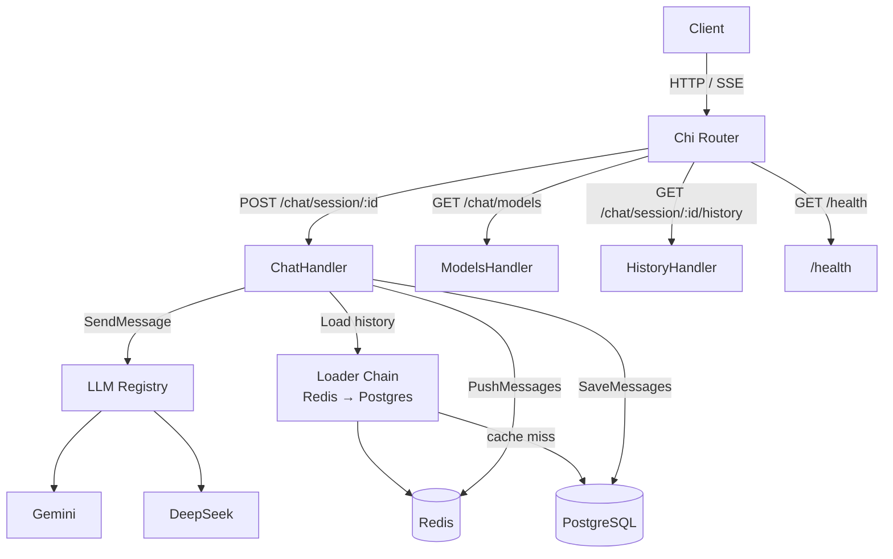
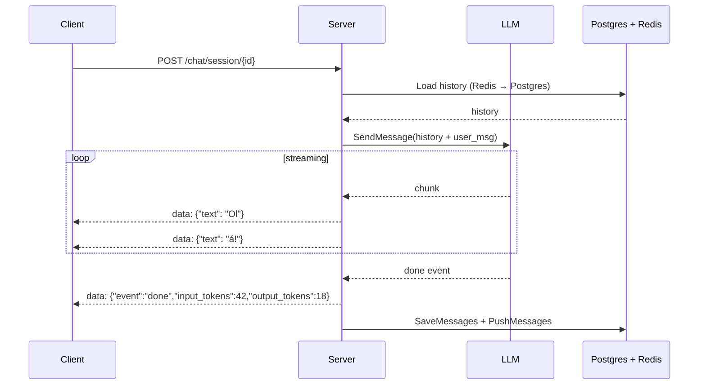
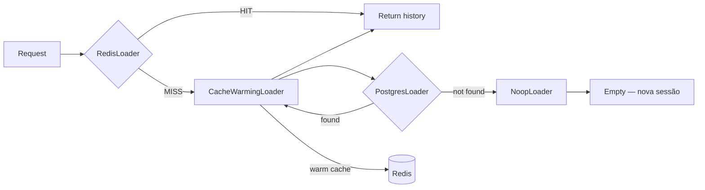
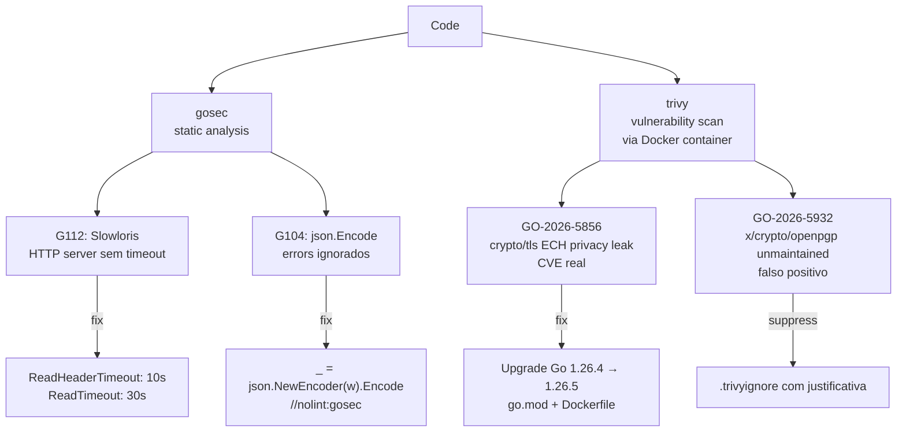

# Como construímos uma API de Chat com IA

> Retrospectiva técnica · Go · 24 commits · 11 fases · 3 providers de LLM · 0 CVEs abertas

Uma linha do tempo dos desafios reais que encontramos ao construir um backend em Go para múltiplos LLMs — com streaming, cache, controle de contexto e segurança — e como resolvemos cada um deles.

---

## Arquitetura final



---

## 01 · Fundação — a estrutura antes das features

**1 commit · 27 arquivos · 1854 linhas**

Antes de escrever qualquer feature, precisamos de um esqueleto: roteamento, validação de entrada, tratamento de erros. Decisões tomadas aqui moldam todo o projeto depois.

**Desafio:** Go não tem convenção forte de estrutura de projeto. Sem uma decisão explícita, handlers viram repositórios de lógica de negócio.

**Solução:** Camadas explícitas desde o início:

| Pacote | Responsabilidade |
|--------|-----------------|
| `server/` | HTTP, roteamento, middleware |
| `model/` | tipos de domínio |
| `repository/` | persistência |
| `llm/` | clientes externos |

Middleware de JSON Schema para validação declarativa antes do handler ver o body.

> **Lição:** Estrutura de pastas não é cosmética — é uma decisão de arquitetura. Separar por responsabilidade evita que handlers virem dumping grounds (lixões).

---

## 02 · Streaming real-time com SSE

**2 commits**

O primeiro grande problema técnico: LLMs não retornam uma resposta completa. Eles geram token por token. O cliente precisa ver isso em tempo real.

**Desafio:** HTTP padrão exige que a resposta seja completa antes de ser enviada. Esperar o LLM terminar (20–60s) torna a experiência inutilizável.

**Solução: Server-Sent Events (SSE)**

O handler sinaliza `Content-Type: text/event-stream` e usa `http.Flusher` para enviar cada chunk imediatamente.

**Strategy Pattern** no `LLMRegistry`: Gemini e DeepSeek implementam a mesma interface. O handler nunca sabe qual provider está usando — só chama `SendMessage`.

```go
// Interface única para todos os providers
type Client interface {
    SendMessage(ctx context.Context, chat model.Chat, fn func(model.MessageChunk) error) error
    CountTokens(ctx context.Context, msg model.Message) (int64, error)
}
```



---

## 03 · Sliding Window — gerenciando o contexto

**3 commits**

LLMs têm um limite máximo de tokens que aceitam como entrada (context window). Conversas longas crescem indefinidamente.

**Desafio:** Depois de algumas dezenas de mensagens, a conversa ultrapassa o limite do modelo. Não podemos simplesmente truncar do início — perdemos o system prompt e as mensagens mais recentes.

**Solução: `BuildWindow` — percorre de trás pra frente**

Em vez de cortar do começo, percorremos o histórico de baixo pra cima acumulando custo estimado em tokens. Preservamos sempre as mensagens mais recentes dentro do budget configurado em `CONTEXT_WINDOW_TOKENS`.

```go
func BuildWindow(msgs []model.Message, contextWindowTokens int) []model.Message {
    var total int64
    for i, msg := range slices.Backward(msgs) {
        cost := int64(len(msg.Content) / 4) // ~4 chars por token
        if total+cost > int64(contextWindowTokens) {
            return msgs[i+1:] // corta tudo antes deste ponto
        }
        total += cost
    }
    return msgs
}
```

**Antes → Depois** (`CONTEXT_WINDOW_TOKENS=8000`):

```
Histórico completo          Context window enviado ao LLM
────────────────────        ─────────────────────────────
[system] Você é...    ✗     [user]      E channels?
[user]   Olá...       ✗     [assistant] Channels são...
[assistant] Claro!    ✗     [user]      Pode dar exemplo?
[user]   Goroutines?  ✗     [assistant] Claro, veja:
[assistant] São...    ✗
[user]   E channels?  ✓  ──▶
[assistant] Channels  ✓
[user]   Exemplo?     ✓
[assistant] Claro:    ✓
```

---

## 04 · Token counting — saber o custo antes de enviar

**2 commits**

Precisamos saber quantos tokens uma mensagem do usuário usa — para billing e logging. Mas fazer isso de forma síncrona bloquearia o stream.

**Desafio:** O SDK do LLM oferece uma chamada de API separada para contar tokens. Fazer essa chamada antes do stream aumenta a latência percebida. Fazer depois perdemos a janela de tempo.

**Solução: goroutine + channel concorrentes**

Disparamos o `CountTokens` em paralelo ao início do stream. Quando o stream termina, coletamos o resultado. Se falhar, estimativa simples como fallback.

```go
tokenCh := make(chan countResult, 1)
go func() {
    countCtx, cancel := context.WithTimeout(r.Context(), 5*time.Second)
    defer cancel()
    tokens, err := client.CountTokens(countCtx, userMessage)
    tokenCh <- countResult{tokens, err}
}()

// ... stream roda aqui em paralelo ...

cr := <-tokenCh // coleta quando stream termina
if cr.err != nil {
    userMessage.InputToken = int64(len(req.Message) / 4) // fallback
} else {
    userMessage.InputToken = cr.tokens
}
```

---

## 05 · Chain of Responsibility — Redis → Postgres

**3 commits**

Carregar o histórico do banco em toda request era lento e caro. Precisávamos de cache — mas cache bem feito tem complexidade própria.

**Desafio 1 — latência:** Postgres levava dezenas de ms por query em conversas longas. Em streaming, isso atrasa o primeiro token visível para o usuário.

**Desafio 2 — cold start:** Na primeira request de uma sessão, o Redis não tem nada. Precisamos ir ao Postgres, buscar, e *aquecer* o cache — de forma transparente.

**Solução: Chain of Responsibility + Decorator**

Dois patterns trabalhando juntos:

- **Chain of Responsibility:** cada loader implementa a mesma interface `ConversationLoader` e delega ao próximo se não tiver a resposta.
- **Decorator:** `CacheWarmingLoader` wraps o `PostgresLoader` sem modificá-lo — intercepta o retorno e popula o Redis como efeito colateral, transparente para quem chama.



**TTL com auto-refresh:** Toda vez que uma sessão é acessada, o TTL no Redis é renovado (`REDIS_SESSION_TTL_IN_MILLIS`, padrão 2h). Sessões ativas nunca expiram enquanto o usuário conversa.

---

## 06 · Conformidade com a spec da API

**3 commits**

Com o core funcionando, hora de alinhar com a especificação OpenAPI: endpoint de listagem de modelos, paginação do histórico, e formato exato dos eventos SSE.

**Desafio:** A spec definia `tokens_used` no evento SSE done, formato de paginação específico no histórico, e um endpoint `GET /chat/models` com metadata de cada modelo. A implementação inicial divergia em todos esses pontos.

**Solução:**

- Endpoint `GET /chat/models` com `ModelInfo` expondo id, name, provider, context_window, description
- Paginação padronizada: `total`, `limit`, `offset`
- SSE done event com `input_tokens` e `output_tokens` separados

---

## 07 · Refatoração — pacotes no mesmo nível conceitual

**2 commits**

`handler/` acumulou três responsabilidades distintas: lógica HTTP, gerenciamento de sessão e catálogo de modelos LLM. Sinal clássico de que um pacote precisa ser dividido.

**Desafio:** `ConversationLoader`, `BuildWindow` e `ModelInfo` viviam em `handler/` — junto com os handlers HTTP. Isso dificultava testes, reuso e entendimento do código.

**Solução: separar por responsabilidade conceitual**

```
Antes                           Depois
──────────────────────────      ────────────────────────────────
handler/chat.go                 aimodels/catalog.go  ← catálogo + LLM wiring
handler/conversation_loader.go  session/loader.go    ← loader chain
handler/window.go               session/window.go    ← BuildWindow
handler/models.go (ModelInfo)   model/message.go     ← tipo de domínio
main.go (120 linhas de catalog) handler/chat.go      ← só HTTP
```

---

## 08 · DevOps — Makefile e Dockerfile seguro

**2 commits**

Build reproduzível e containerização com postura de segurança — não apenas "funciona no Docker", mas com o mínimo de superfície de ataque.

**Desafio:** Imagens Docker que rodam como root, com binários debug incluídos, sem HEALTHCHECK e sem certificados CA instalados são comuns — e problemáticas em produção.

**Solução: multi-stage build com hardening**

| Stage | Base | O que faz |
|-------|------|-----------|
| Builder | `golang:1.26.5-alpine` | `go build -ldflags="-w -s"` (strip debug info) |
| Runtime | `alpine:3.21` | Sem Go toolchain, somente o binário |

Configurações de segurança no runtime:
- Usuário `app-user` não-root
- `chmod -R 500 /app` (read + execute only)
- `passwd -l root` (root bloqueado)
- `ca-certificates` instalado para chamadas TLS aos LLMs
- `HEALTHCHECK` no endpoint `/health` → `{"status":"ok"}`

**Makefile** com targets claros:

```
make run          # rodar localmente
make test         # testes
make test-race    # testes com race detector
make build        # build do binário
make gosec        # análise estática de segurança
make trivy        # scan de vulnerabilidades (via Docker)
make sec-check    # gosec + trivy
```

---

## 09 · Segurança — gosec e trivy

**5 commits**

Scanners de segurança revelam classes inteiras de problemas que code review não pega. Cada finding exigiu uma decisão consciente.



**Sobre o G104 (`json.Encode`):** `json.Encode` retorna erro quando o `ResponseWriter` já fechou a conexão — o cliente foi embora, não há como recuperar. Ignorar é correto; `//nolint:gosec` com comentário documenta a decisão deliberada.

**Sobre o GO-2026-5932:** A lib `x/crypto/openpgp` é declarada unmaintained pelo trivy, mas não é usada diretamente pelo nosso código — é dependência transitiva. Suprimimos com `.trivyignore` documentado, não silenciamos cegamente.

> **Lição:** O valor dos scanners é forçar uma decisão consciente. Para CVEs reais, corrija. Para falsos positivos, documente — nunca ignore sem explicação.

---

## 10 · Bugs encontrados em uso real

**2 commits**

Testes automatizados verificam contratos de código, não comportamento real. Dois bugs só apareceram ao usar a API com clientes reais — e as causas raiz eram sutis.

### Bug 1 — `system_prompt` idempotency

**Sintoma:** Clientes que reenviavam o mesmo `system_prompt` a cada mensagem recebiam `400 Bad Request` — mesmo sem tentar trocar nada.

**Causa raiz:** O guard checava *presença* (`!= ""`), não *conteúdo*. Qualquer `system_prompt` em conversa existente disparava o erro.

```go
// antes: guard incorreto
if found && req.SystemPrompt != "" {
    return NewHTTPError(http.StatusBadRequest, "cannot override system prompt")
}

// depois: compara conteúdo
if found && req.SystemPrompt != "" {
    existing := ""
    for _, m := range history {
        if m.Role == model.RoleSystem { existing = m.Content; break }
    }
    if req.SystemPrompt != existing {
        return NewHTTPError(http.StatusBadRequest, "cannot override system prompt")
    }
    // mesmo conteúdo — idempotente, continua
}
```

**Regra resultante:**

| Situação | Resultado |
|----------|-----------|
| Nova sessão + qualquer `system_prompt` | 200 — armazenado como `role=system` |
| Sessão existente + **mesmo** `system_prompt` | 200 — idempotente, ignorado |
| Sessão existente + `system_prompt` **diferente** | 400 — tentativa de override |
| Sessão existente + sem `system_prompt` | 200 — turno normal |

### Bug 2 — system prompt aparecia após mensagens do usuário

**Sintoma:** No histórico retornado, `role=system` aparecia no meio ou no final — como se o modelo tivesse "falado" depois do usuário.

**Causa raiz:** As queries usavam `ORDER BY created_at ASC`. Porém, todas as mensagens inseridas na mesma request (system + user + assistant) compartilham o mesmo `time.Now()`. O banco desempata arbitrariamente.

```sql
-- antes (não determinístico para inserções simultâneas)
SELECT * FROM messages WHERE session_id = $1 ORDER BY created_at ASC

-- depois (serial autoincrement = ordem de inserção garantida)
SELECT * FROM messages WHERE session_id = $1 ORDER BY id ASC
```

> **Lição:** Timestamps têm resolução limitada — múltiplas inserções na mesma request compartilham o mesmo valor. Use `id` serial para garantir ordem de inserção.

---

## 11 · Graceful Shutdown — desligar sem perder dados

**1 commit**

Um servidor que para abruptamente no meio de um request SSE corta o stream do cliente e pode perder mensagens que ainda não foram persistidas no Postgres.

**Desafio:** `os.Exit` e `SIGKILL` encerram o processo imediatamente. Requests em andamento são abandonados sem chance de finalizar o stream ou completar o `SaveMessages`.

**Solução: `signal.NotifyContext` + `srv.Shutdown`**

`signal.NotifyContext` transforma SIGINT/SIGTERM em cancelamento de context — o mesmo mecanismo já usado em todo o código. Quando o sinal chega:

1. `ctx.Done()` é fechado — ping goroutines param pelo `select`
2. `srv.Shutdown(shutdownCtx)` para de aceitar novas conexões e espera as requests ativas terminarem (até 10s)
3. `defer pg.Close()` e `defer rdb.Close()` rodam depois que o servidor drenou

```go
ctx, stop := signal.NotifyContext(context.Background(), os.Interrupt, syscall.SIGTERM)
defer stop()

// servidor em goroutine
go func() {
    if err := srv.ListenAndServe(); err != nil && err != http.ErrServerClosed {
        slog.Error("server error", "error", err)
        os.Exit(1)
    }
}()

<-ctx.Done()   // bloqueia até SIGINT ou SIGTERM
stop()         // libera o signal handler (segundo Ctrl+C mata imediatamente)

slog.Info("shutdown signal received, draining connections")
shutdownCtx, cancel := context.WithTimeout(context.Background(), 10*time.Second)
defer cancel()
if err := srv.Shutdown(shutdownCtx); err != nil {
    slog.Error("graceful shutdown failed", "error", err)
    os.Exit(1)
}
slog.Info("shutdown complete")
```

**Por que chamar `stop()` antes do Shutdown?**
Após o primeiro sinal, `stop()` cancela o handler. Um segundo SIGINT (impaciência do operador) passa direto para o processo e mata sem esperar — comportamento esperado em produção.

**Por que as ping goroutines precisam de `select`?**
`for range ticker.C` não verifica cancelamento — a goroutine ficaria viva tentando pingar um banco enquanto o processo está tentando fechar. Com `select { case <-ctx.Done(): return }` elas param imediatamente.

> **Lição:** Graceful shutdown não é sobre o processo — é sobre as requisições em andamento. `srv.Shutdown` garante que os clientes recebam a resposta completa (ou pelo menos o evento de erro) antes da conexão fechar.

---

## Glossário

| Termo | Significado |
|-------|-------------|
| **LLM** | Large Language Model — modelo de linguagem grande (ex: Gemini, GPT, DeepSeek). Recebe texto como entrada e gera texto como saída, token por token. |
| **Token** | Unidade mínima de processamento de um LLM. Aproximadamente 4 caracteres em inglês ou 3 em português. Tanto entrada quanto saída consomem tokens. |
| **Context Window** | Limite máximo de tokens que um LLM aceita em uma única chamada (entrada + saída). Cada modelo tem seu próprio limite. |
| **Sliding Window** | Estratégia para respeitar o context window: ao invés de truncar do início, percorre o histórico de trás pra frente e descarta mensagens antigas até o custo caber no limite. |
| **SSE** | Server-Sent Events — protocolo HTTP unidirecional onde o servidor envia eventos em tempo real para o cliente. Permite exibir tokens do LLM conforme chegam, sem esperar a resposta completa. |
| **Graceful Shutdown** | Encerramento controlado do servidor: para de aceitar novas conexões, espera as requisições em andamento terminarem, depois fecha recursos (banco, cache). Evita perda de dados e respostas cortadas. |
| **Strategy Pattern** | Pattern onde múltiplas implementações de uma mesma interface são intercambiáveis em tempo de execução. Usado aqui no `LLMRegistry`: Gemini e DeepSeek são strategies de `Client`. |
| **Chain of Responsibility** | Pattern onde uma requisição percorre uma cadeia de handlers até ser resolvida. Usado no loader de histórico: Redis → CacheWarmingLoader → Postgres → Noop. |
| **Decorator Pattern** | Pattern que adiciona comportamento a um objeto sem modificá-lo, wrappando-o. Usado no `CacheWarmingLoader`: decora o `PostgresLoader` para aquecer o Redis após cada carga. |
| **Cache Warming** | Popular o cache (Redis) proativamente com dados buscados de uma fonte lenta (Postgres), para que a próxima leitura seja rápida sem precisar ir ao banco. |
| **Cold Start** | Primeira requisição de uma sessão, quando o cache ainda está vazio. Exige busca no banco e aquecimento do cache. |
| **TTL** | Time To Live — tempo de vida de uma entrada no cache. Após expirar, a entrada é removida automaticamente. Aqui: TTL do Redis é renovado a cada mensagem da sessão. |
| **Idempotência** | Propriedade de uma operação que produz o mesmo resultado independentemente de quantas vezes é executada com os mesmos parâmetros. Reenviar o mesmo `system_prompt` é idempotente — não deve gerar erro. |
| **Goroutine** | Unidade leve de concorrência do Go, gerenciada pelo runtime (não pelo SO). Permite rodar milhares de goroutines simultaneamente com baixo custo de memória. |
| **Channel** | Mecanismo de comunicação entre goroutines no Go. Garante sincronização segura sem locks explícitos. Usado aqui para coletar o resultado do `CountTokens` em paralelo ao stream. |
| **pgxpool** | Pool de conexões PostgreSQL para Go (`jackc/pgx`). Gerencia conexões abertas, reutiliza-as entre requests e controla o número máximo de conexões simultâneas. |
| **CVE** | Common Vulnerabilities and Exposures — identificador público de vulnerabilidades de segurança. Ex: `GO-2026-5856` é uma CVE no pacote `crypto/tls` do Go. |
| **Slowloris** | Ataque de negação de serviço que abre muitas conexões HTTP e as mantém abertas enviando headers lentamente, esgotando os workers do servidor. Mitigado com `ReadHeaderTimeout`. |
| **gosec** | Ferramenta de análise estática de segurança para Go. Detecta padrões conhecidos de vulnerabilidade no código-fonte sem executá-lo. |
| **trivy** | Scanner de vulnerabilidades que analisa dependências, imagens Docker e código em busca de CVEs conhecidas. |

---

## O que aprendemos

1. **Patterns clássicos resolvem problemas reais.** Strategy, Chain of Responsibility, Decorator — não são teoria de livro. Cada um apareceu naturalmente ao nomear o problema certo.

2. **Timestamps não servem como chave de ordenação.** Múltiplas inserções na mesma request compartilham o mesmo timestamp. Use serial ids ou sequence fields para garantir ordem de inserção.

3. **Security scanners revelam o que code review não vê.** Slowloris é um ataque conhecido há anos — mas sem um scanner apontando, facilmente esquecemos de configurar timeouts no servidor HTTP.

4. **Interfaces definem contratos; implementações são substituíveis.** `ConversationLoader` permite trocar Redis por Memcached sem tocar no handler. `Client` permite adicionar um novo LLM sem mexer no roteamento.

5. **Idempotência não é detalhe — é UX.** Clientes reais reenviam dados em toda request. Uma API que retorna 400 para operações idempotentes está quebrando contratos implícitos do protocolo HTTP.

6. **Pacotes grandes são débito técnico adiado.** `handler/` acumulou três domínios diferentes. Refatorar cedo é sempre mais barato do que depois que o time cresce e o acoplamento aprofunda.
